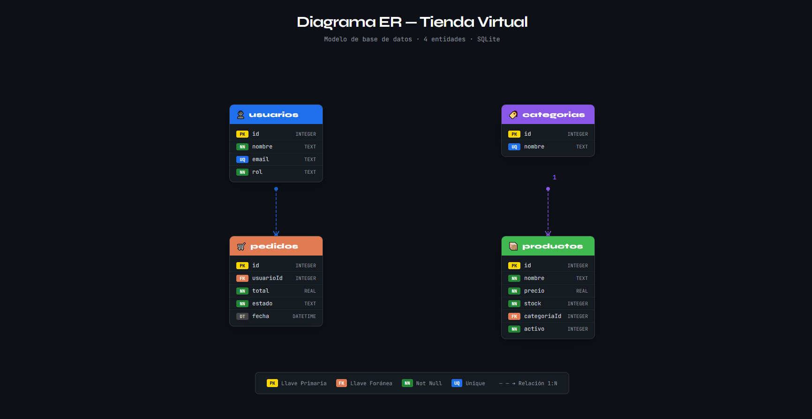

# 🛒 API Tienda Virtual

API REST desarrollada con Node.js, Express y SQLite3.  
Proyecto de la asignatura Análisis y Desarrollo de Software — SENA.

---

## 🌐 URL de la API en producción
https://mi-primera-api-e0ho.onrender.com

---

## 🔐 Autenticación
Todos los endpoints requieren el siguiente header:

| Header | Valor |
|--------|-------|
| password | sena2025 |

---

## 📦 Tecnologías usadas

- Node.js
- Express
- SQLite3

---

## 🗂️ Estructura del proyecto
```
NODEJS/
├── routes/
│   ├── UsuariosRoutes.js
│   ├── ProductosRoutes.js
│   ├── CategoriasRoutes.js
│   └── PedidosRoutes.js
├── db.js
├── index.js
└── package.json
```

---

## 🔗 Endpoints disponibles

| Método | Ruta | Descripción |
|--------|------|-------------|
| GET | /api/usuarios | Ver todos los usuarios |
| POST | /api/usuarios | Crear usuario |
| PUT | /api/usuarios/:id | Actualizar usuario |
| DELETE | /api/usuarios/:id | Eliminar usuario |
| GET | /api/categorias | Ver todas las categorías |
| POST | /api/categorias | Crear categoría |
| PUT | /api/categorias/:id | Actualizar categoría |
| DELETE | /api/categorias/:id | Eliminar categoría |
| GET | /api/productos | Ver todos los productos |
| POST | /api/productos | Crear producto |
| PUT | /api/productos/:id | Actualizar producto |
| DELETE | /api/productos/:id | Eliminar producto |
| GET | /api/pedidos | Ver todos los pedidos |
| POST | /api/pedidos | Crear pedido |
| PUT | /api/pedidos/:id | Actualizar pedido |
| DELETE | /api/pedidos/:id | Eliminar pedido |

---

## 🗃️ Diagrama ER



---

## ▶️ Cómo ejecutar
```bash
npm install
node index.js
```

El servidor corre en: http://localhost:3000

---

## 🗃️ Diccionario de Datos

Descripción de cada tabla de la base de datos con sus campos y restricciones.

### Tabla: usuarios
Guarda la información de los usuarios que hacen pedidos en la tienda.

| Campo | Tipo | Restricción | Descripción |
|-------|------|-------------|-------------|
| id | INTEGER | PK, AUTO | Identificador único del usuario |
| nombre | TEXT | NOT NULL | Nombre completo del usuario |
| email | TEXT | NOT NULL, UNIQUE | Correo electrónico, no se puede repetir |
| rol | TEXT | DEFAULT 'cliente' | Rol del usuario: cliente o administrador |

### Tabla: categorias
Organiza los productos por tipo o grupo.

| Campo | Tipo | Restricción | Descripción |
|-------|------|-------------|-------------|
| id | INTEGER | PK, AUTO | Identificador único de la categoría |
| nombre | TEXT | NOT NULL, UNIQUE | Nombre de la categoría, sin repetidos |

### Tabla: productos
Contiene todos los productos disponibles en la tienda.

| Campo | Tipo | Restricción | Descripción |
|-------|------|-------------|-------------|
| id | INTEGER | PK, AUTO | Identificador único del producto |
| nombre | TEXT | NOT NULL | Nombre del producto |
| precio | REAL | NOT NULL, CHECK >0 | Precio del producto, mayor a 0 |
| stock | INTEGER | NOT NULL, CHECK >=0 | Cantidad disponible, no puede ser negativa |
| categoriaId | INTEGER | FK → categorias(id) | Categoría a la que pertenece |
| activo | INTEGER | DEFAULT 1 | 1 = activo, 0 = inactivo |

### Tabla: pedidos
Registra los pedidos realizados por los usuarios.

| Campo | Tipo | Restricción | Descripción |
|-------|------|-------------|-------------|
| id | INTEGER | PK, AUTO | Identificador único del pedido |
| usuarioId | INTEGER | FK → usuarios(id) | Usuario que realizó el pedido |
| total | REAL | NOT NULL, CHECK >0 | Valor total del pedido |
| estado | TEXT | DEFAULT 'pendiente' | Estado: pendiente, enviado o entregado |
| fecha | DATETIME | DEFAULT NOW | Fecha y hora del pedido |